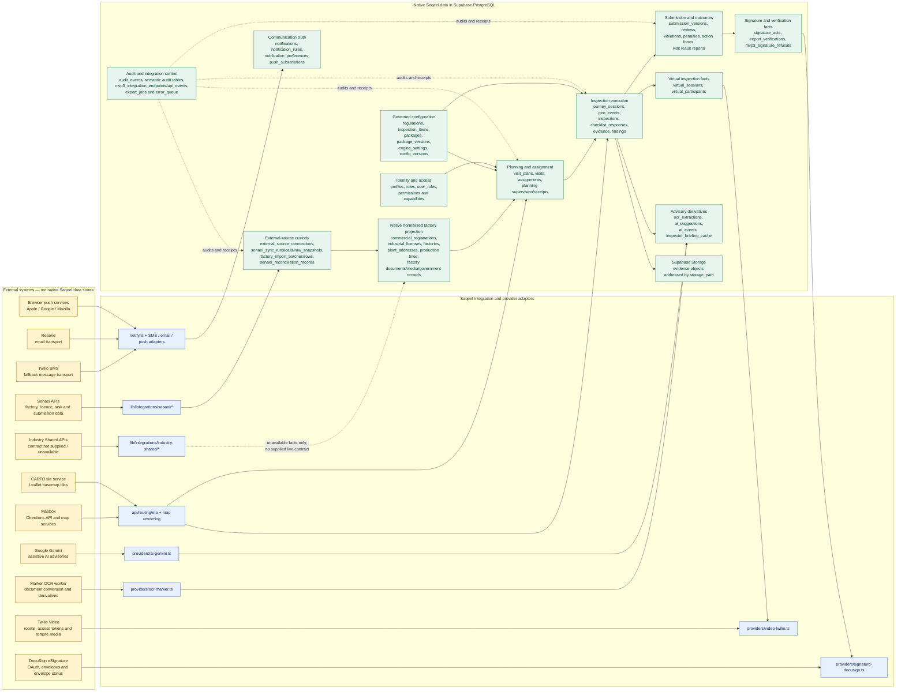
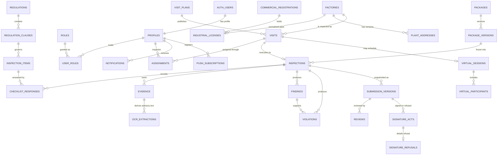

# Inspection Platform data model and external-system boundaries

This document describes the data model present in the repository. It separates:

- **Native Saqeel records** stored in the project’s Supabase PostgreSQL database.
- **External-source custody and projections** stored by Saqeel but sourced from another system.
- **External provider-owned data or processing** that remains outside the Saqeel database.
- **Unclear or unavailable boundaries** where the repository does not prove a live contract.

It is a logical model, not a complete column-level ERD of every table in the migration history.

## System boundary

## Native core relationships

## Ownership and persistence by external system

| External system | What remains external | Native Saqeel records or references | Proven repository boundary |
|---|---|---|---|
| **Senaei** | Upstream API data and provider-side task/submission state | `external_source_connections`, `senaei_sync_runs`, `senaei_sync_calls`, `senaei_raw_snapshots`, import/reconciliation records, then normalized commercial registration/licence/factory/plant records with source metadata | `apps/web/src/lib/integrations/senaei/*`; `20260720010000_factory360_v2_foundation.sql` |
| **Industry Shared** | All authoritative provider data | Canonical projection returns explicit unavailable/contract-unverified facts; demo rows can carry `industry_shared_demo_seed` provenance | Client exists under `lib/integrations/industry-shared/*`, but it returns `INDUSTRY_SHARED_API_CONTRACT_NOT_SUPPLIED`; live ownership is **unclear — needs confirmation** |
| **DocuSign** | OAuth tokens, envelopes, signer workflow, envelope status | `signature_acts` stores the native signature/refusal fact; `report_verifications` stores provider/status/detail evidence | `providers/signature-docusign.ts`; committee actions. Adapter is explicitly short-term and not the production KSA PKI/EBDA authority |
| **Twilio Video** | Twilio room resource, access-token service, remote participant media and any provider-side media state | `virtual_sessions` and `virtual_participants`; Saqeel uses the session ID as the Twilio room unique name | `providers/video-twilio.ts`; virtual video actions. No native table column for Twilio Room SID was found |
| **Twilio SMS** | Message transport and Twilio message SID/status | `notifications` remains the communication source of truth, including channel and delivery state | `providers/sms-twilio.ts` registered through `notify.ts`; Twilio is coded as the fallback SMS transport, not a native OTP engine |
| **Resend** | Email transport and provider message ID | `notifications` delivery row | `providers/email-resend.ts` registered through `notify.ts` |
| **Browser push services** | Apple/Google/Mozilla delivery infrastructure | `push_subscriptions` stores endpoints/keys; `notifications` stores the delivery attempt/truth | `providers/push-webpush.ts`; Web Push uses self-issued VAPID credentials but external browser push services |
| **Marker OCR worker** | Document conversion process and worker job execution | `ocr_extractions` stores advisory derivatives linked to original `evidence`; original evidence is not replaced | `providers/ocr-marker.ts`; imported by both current OCR action paths |
| **Google Gemini** | Model inference | `ai_suggestions`, append-only `ai_events`, and `inspector_briefing_cache` store advisory output/state | `providers/ai-gemini.ts`. `ocr-gemini.ts` exists but has no import site; current OCR actions import Marker |
| **Mapbox** | Directions response and provider map services | ETA/distance is returned by the route handler; native planning/journey/geo records retain Saqeel coordinates and events | `app/api/routing/eta/route.ts`, Mapbox-related provider code |
| **CARTO** | Basemap tiles | No CARTO-owned business data is copied into native tables | Leaflet map components reference remote tile service; exact deployment/provider SLA is **unclear — needs confirmation** |
| **Supabase managed platform** | Hosted Auth, PostgREST, Storage service and database infrastructure | The PostgreSQL schema is the native Saqeel system of record; `profiles.user_id` references `auth.users`; evidence rows reference Storage object paths | `@supabase/ssr`, `@supabase/supabase-js`, migrations and Storage calls |

## Native domain groups

| Native domain | Key tables |
|---|---|
| Identity and authorization | `profiles`, `roles`, `user_roles`, `permissions`, `role_permissions`, `capabilities`, `role_capabilities`, `user_capability_grants` |
| Governed configuration | `config_versions`, `engine_settings`, `regulations`, `regulation_clauses`, `inspection_items`, item versions/states, `packages`, `package_versions`, package snapshots, `violation_codes`, `penalty_mappings`, notification and planning configuration |
| Factory 360 and master data | `commercial_registrations`, `industrial_licenses`, `factories`, `plant_addresses`, `plant_production_line_items`, products/materials, documents/media/government records, risk snapshots, inspection factory snapshots |
| Planning and assignment | `visit_plans`, `visits`, `assignments`, `visit_packages`, planning supervision requests, process commands/targets/receipts, mutation receipts and archives |
| Field journey and inspection | `journey_sessions`, `geo_events`, location corrections/events, `inspections`, `checklist_responses`, `evidence`, `findings`, visit preparations and attachments |
| Submission, review and enforcement | `submission_versions`, `reviews`, review comments, `violations`, `inspection_penalties`, penalty notices, `action_forms`, enforcement recommendations, bulk violation batches/items, visit result reports/samples/seized products |
| Virtual inspection | `virtual_sessions`, `virtual_participants` |
| Communication | `notifications`, `notification_rules`, `notification_preferences`, `push_subscriptions` |
| Advisory AI/OCR | `ai_suggestions`, `ai_events`, `ocr_extractions`, `inspector_briefing_cache` |
| Audit and integration control | `audit_events`, semantic audit tables, `mvp3_integration_endpoints`, `mvp3_api_events`, `mvp3_export_jobs`, `mvp3_error_queue` |

## Boundary findings

- **Native does not mean locally hosted.** Supabase is an external managed platform, but its PostgreSQL schema is the native Saqeel system of record.
- **A provider adapter is not a data store.** Credentials remain in environment variables; they are not part of the database model.
- **External-source copies keep provenance.** Senaei custody/raw/import tables are native Saqeel records about an external feed; normalized factory records remain source-labelled.
- **Remote media is not evidence by default.** Twilio owns room/media transport. The checked-in model does not prove that a recording is enabled, retained, or copied into `evidence`.
- **Delivery acceptance is not human receipt.** Twilio SMS, Resend, and Web Push adapter success means the external service accepted the message; `notifications.delivery_state` must not be interpreted as proof that a person read it.
- **OCR and AI outputs are advisory.** `ocr_extractions` and `ai_suggestions` do not become authoritative inspection answers without governed human action.
- **Industry Shared remains an explicit gap.** The repository contains types and an unavailable-result client, but no supplied live API contract or runtime fetch.
- **DocuSign is not the final trust authority.** The adapter comments identify it as a short-term provider; production KSA PKI/EBDA selection remains outside the proven model.

## Evidence used

- Table, foreign-key, RLS, trigger, view and RPC definitions under `supabase/migrations/*`.
- Provider and integration adapters under `apps/web/src/lib/providers/*` and `apps/web/src/lib/integrations/*`.
- Actual provider import/call sites in committee, virtual inspection, notification, Factory 360, AI and OCR flows.
- Environment-variable contract in `apps/web/.env.example`.
- Supabase client, Storage and route-handler calls under `apps/web/src`.
