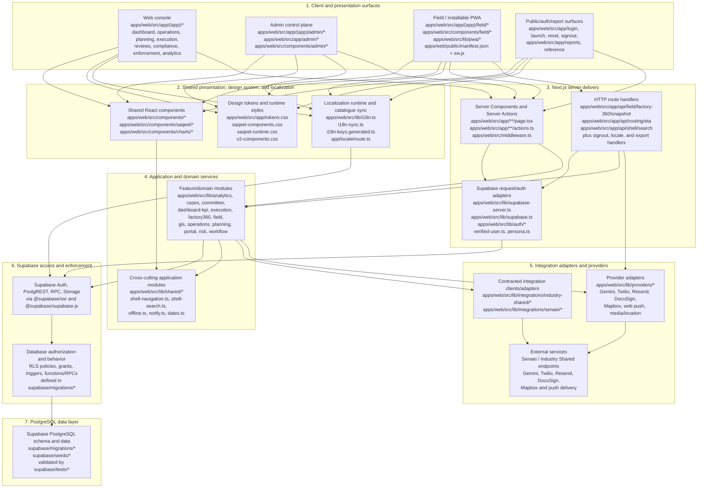

# Inspection repository layers

This view describes the code present in the repository at the time of inspection. It is not a target architecture. Dependency arrows mean “imports, invokes, reads from, or is configured by.”

| Layer | Key dirs | Depends on |
|---|---|---|
| Client and presentation surfaces | `apps/web/src/app/(app)/*`; `apps/web/src/app/(app)/field/*`; `apps/web/src/app/(app)/admin/*`; `apps/web/src/app/admin/*`; public/auth/report routes under `apps/web/src/app/*` | Shared components, design system, i18n, Next.js Server Components/Actions; the field client also calls the small HTTP API surface |
| Shared presentation and design system | `apps/web/src/components/*`; `apps/web/src/components/saqeel/*`; `apps/web/src/components/charts/*`; `apps/web/src/app/tokens.css`; `saqeel-components.css`; `saqeel-runtime.css`; `v2-components.css` | Application helpers where imported; CSS component rules consume variables from `tokens.css` |
| Localization | `apps/web/src/lib/i18n.ts`; `i18n-sync.ts`; `i18n-keys.generated.ts`; `apps/web/src/app/locale/route.ts`; localization migrations such as `supabase/migrations/0013_ui_strings_localization.sql` and later `*_ar_strings.sql` files | Supabase `ui_strings` through `@supabase/supabase-js`; English source strings and reviewed in-code fallbacks |
| Next.js server delivery | `apps/web/src/app/**/page.tsx`; `apps/web/src/app/**/actions.ts`; `apps/web/src/app/api/**/route.ts`; `apps/web/src/middleware.ts` | Auth/Supabase adapters, domain modules, provider adapters, and Supabase directly |
| Application and domain services | Feature groups under `apps/web/src/lib/`: `analytics`, `ai`, `cases`, `committee`, `dashboard-kpi`, `execution`, `factory360`, `field`, `gis`, `operations`, `planning`, `portal`, `risk`, `workflow`; plus cross-cutting files and `shared/*` | Supabase client types/queries, integration adapters, provider adapters, and other local domain helpers |
| Integration adapters and providers | `apps/web/src/lib/integrations/industry-shared/*`; `apps/web/src/lib/integrations/senaei/*`; `apps/web/src/lib/providers/*` | Configured external endpoints/services and, for some adapters, Supabase-backed application state |
| Supabase access and enforcement | `apps/web/src/lib/supabase-server.ts`; `apps/web/src/lib/supabase.ts`; `apps/web/src/lib/supabase-pagination.ts`; SQL policies, grants, triggers, and RPCs in `supabase/migrations/*` | Supabase Auth, PostgREST, Storage, and PostgreSQL |
| PostgreSQL data layer | `supabase/migrations/*`; `supabase/seeds/*`; `supabase/tests/*` | Bottom layer; migrations define the schema, RLS, functions, triggers, indexes, and seedable data |
| Repository governance and delivery support (non-runtime) | `product-contract/*`; `docs/*`; `design/*`; `designs/*`; `status/*`; `scripts/*`; `apps/web/e2e/*` | Describes, designs, tests, or governs the runtime layers; it is not imported as a production runtime layer |

## Boundary notes

- The repository root is a script-forwarding wrapper for one application package, `apps/web`. No `packages/` directory or separate native/mobile package exists.
- “Web,” “Admin,” and “Field/PWA” are surfaces within the same Next.js application, not independently deployed clients. The PWA behavior is supplied by `apps/web/public/manifest.json`, `apps/web/public/sw.js`, `PwaRegister.tsx`, and `apps/web/src/lib/pwa/*`.
- The backend boundary is hybrid. Three handlers live under `apps/web/src/app/api/**`, but many Server Components and Server Actions import `supabaseServer()` and execute RLS-scoped `.from(...)`, `.rpc(...)`, Auth, or Storage operations directly. Therefore `app/api` is not a universal API gateway.
- Supabase supplies the deployed backend capabilities visible in this repository: PostgreSQL, RLS/grants, database functions/RPCs, triggers, Auth-facing clients, PostgREST, and Storage. There is no `supabase/functions/` directory, so a Supabase Edge Functions layer is not present in the checked-in code.
- Shared code is local to `apps/web/src/lib` and `apps/web/src/components`; it is not published or isolated as workspace packages.
- The exact deployment topology and whether every provider adapter is enabled in each environment are **unclear — needs confirmation**. The code gates providers through environment configuration and explicitly returns unavailable states when configuration is absent.

## Evidence used for dependency direction

- `apps/web/src/app/layout.tsx` imports `tokens.css`, `saqeel-components.css`, and `saqeel-runtime.css`, and loads the locale through `@/lib/i18n`.
- Route pages and action modules import `@/components/*` and `@/lib/*`; many import `@/lib/supabase-server` and issue table or RPC calls.
- The API handlers import `supabase-server`, feature modules such as `factory360/dossier`, and provider-facing logic such as the Mapbox routing call.
- Domain modules import Supabase client types/adapters and, where needed, `lib/integrations/*` or `lib/providers/*`; for example, `factory360/dossier.ts` imports the Senaei client and adapters.
- `supabase-server.ts`, `supabase.ts`, `middleware.ts`, and `i18n.ts` use `@supabase/ssr` or `@supabase/supabase-js`.
- The SQL migration history defines database tables, RLS policies, grants, triggers, functions/RPCs, localization data, workflow behavior, and indexes; SQL probes under `supabase/tests` validate those database contracts.

