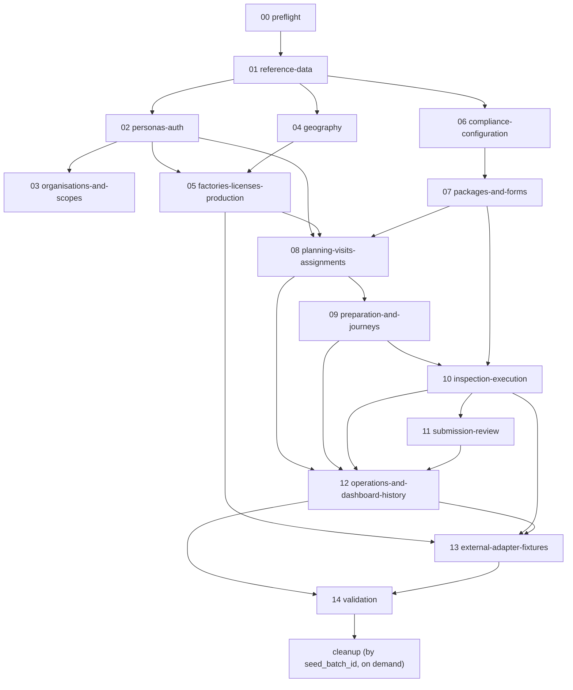

# Seed Dependency DAG

Mode: design/plan only — no seeding executed. Grounded in `supabase/migrations/0001_foundation.sql` (30 tables per `product-contract/CURRENT_STATE.md`) plus tables confirmed via later migrations referenced elsewhere in this pass (`industrial_licenses`, `plant_production_line_items`, `notification_preferences`, `notification_rules`, `inspection_factory_checks`). The full 130-migration catalogue was not exhaustively re-enumerated in this pass — Section A of the full discovery blueprint (`SCHEMA_CATALOG.csv` etc.) is the authoritative source for a complete object list and is out of scope for this H+I+J pass.

## 1. Module-to-table ownership (matches the blueprint's recommended `scripts/seed/` order)

| # | Module | Primary tables written | Upstream dependency |
|---|---|---|---|
| 00 | preflight | none (read-only: proves project ref, non-production, migration state) | — |
| 01 | reference-data | `roles`, `config_versions`, `engine_settings` (verify-only — accepted v1 values already seeded per `0001_foundation.sql`/`0003_seed_contract_data.sql`, never overwritten) | 00 |
| 02 | personas-auth | `auth.users` (via Admin API), `profiles`, `user_roles` | 01 (roles must exist to grant) |
| 03 | organisations-and-scopes | department/team/reporting-line tables if they exist (unconfirmed — flag as open decision; if absent, encode scope on `profiles`/`user_roles` only) | 02 |
| 04 | geography | KSA region/city reference tables if canonical (unconfirmed against `lib/ksa-regions.ts` per memory — verify whether this is DB-backed or code-only before writing rows) | 01 |
| 05 | factories-licenses-production | `factories`, `industrial_licenses`, `plant_production_line_items` | 04 (region/city), 02 (owning/contact profiles if FK'd) |
| 06 | compliance-configuration | `regulations`, `regulation_clauses`, `inspection_items`, `violation_codes`, `penalty_mappings` | 01 |
| 07 | packages-and-forms | `packages`, `package_versions` | 06 |
| 08 | planning-visits-assignments | `visit_plans`, `visits`, `assignments` | 02 (planner/inspector personas), 05 (factories), 07 (published package version) |
| 09 | preparation-and-journeys | `journey_sessions`, `geo_events`, preparation/snapshot tables (`visit_preparations`, `visit_package_snapshots` per blueprint — confirm exact names against live schema before writing) | 08 |
| 10 | inspection-execution | `inspections`, `checklist_responses`, `evidence`, `findings`, `violations`, `action_forms` | 09, 07 |
| 11 | submission-review | `submission_versions`, `reviews` | 10 |
| 12 | operations-and-dashboard-history | `notifications`, `notification_preferences`, `notification_rules`, `audit_events` (mostly audit-generated, not directly inserted), dashboard config/KPI source facts spanning the prior 12 months | 08–11 (needs a full year of upstream activity to backfill) |
| 13 | external-adapter-fixtures | No direct table writes — exercises the Senaei/Industry Shared/notification/video/map/location/media provider seams per `ADAPTER_REPLACEMENT_PLAN.md` and records only their honest `not_configured`/`degraded`/`stub` outcomes into `notifications`/`inspection_factory_checks` where applicable | 05, 10, 12 |
| 14 | validation | read-only — runs the checks in `SEED_VALIDATION_PLAN.md` | all prior |
| — | cleanup | deletes/reverts only rows tagged with the run's `seed_batch_id` | — |

## 2. Mermaid dependency graph

## 3. Hard ordering constraints

1. `02-personas-auth` MUST precede any module that writes a `created_by`/`assigned_to`/`recipient` foreign key to a `profiles.user_id` — this includes every module 05 through 12.
2. `01-reference-data` never overwrites the already-accepted `engine_settings` rows (`risk`/`gis`/`sla`/`evidence`/`otp` v1, per `product-contract/CURRENT_STATE.md`) — it only verifies they exist and fails the run if they are missing or mutated, since inventing replacement policy values is explicitly forbidden by `CLAUDE.md`.
3. `06-compliance-configuration` and `07-packages-and-forms` must complete, including at least one published package version and one intentionally unpublished/draft package version (per the blueprint's fail-closed test requirement), before `08-planning-visits-assignments` runs, because visits reference a package version.
4. `12-operations-and-dashboard-history` depends on the FULL set of prior modules having produced a coherent 12-month spread of dated activity (see §4) — it does not itself invent KPI numbers; it only ensures enough source rows with varied `created_at`/status/region/severity exist for the existing dashboard KPI engine to compute trends from (per the blueprint's "do not hardcode dashboard values" rule and precedent in `apps/web/scripts/seed-dashboard-kpis.mjs`).
5. `13-external-adapter-fixtures` must run AFTER factories/inspections exist (it attaches provenance-labeled synthetic-adapter outcomes to real rows) but its own writes must never block on a real external network call succeeding — every write in this module resolves through a fail-closed or stub path per `ADAPTER_REPLACEMENT_PLAN.md`.
6. `14-validation` is read-only and must run last, before any success is reported.
7. `cleanup` is invoked independently of the forward chain; it is never run automatically as part of a normal seed pass (see `SEED_CLEANUP_AND_ROLLBACK.md`).

## 4. Time-series backfill note for module 12

12 months of history (blueprint §Seed data layers, item 7) is produced by having modules 08–11 run multiple times across a simulated date range anchored to a single `SEED_ANCHOR_DATE` (see `SEEDER_IMPLEMENTATION_PLAN.md` §Seed anchor date), not by a separate bulk-insert into dashboard tables. Each simulated month re-invokes 08→09→10→11 with `created_at`/`visit_date`/`submitted_at` timestamps offset backward from the anchor date, still going through the same RPCs/insert paths as a "live" run so audit events (`audit_events`) and workflow transitions remain real, just backdated.

## 5. Unresolved schema questions this DAG surfaces (do not resolve by invention)

- Exact table names for `visit_preparations`/`visit_package_snapshots`/`configuration_templates`/journey/geofence-request/cancellation-request objects referenced only as "[discover exact table]" in the blueprint's mindmap — these must be confirmed against a live `list_tables` pass (Section A of the full discovery blueprint) before Section I is implemented.
- Whether `organisations-and-scopes` (module 03) and `geography` (module 04) have real dedicated tables or are folded into `profiles`/`factories` columns — unconfirmed in this pass.
- Whether `samples`/`seizure` and committee/decision-dossier signature tables (`lib/committee/signature.ts`) are schema-ready — flagged in `ADAPTER_REPLACEMENT_PLAN.md` §2.9 and the blueprint's own scenario catalogue ("samples/seizure if schema ready").
